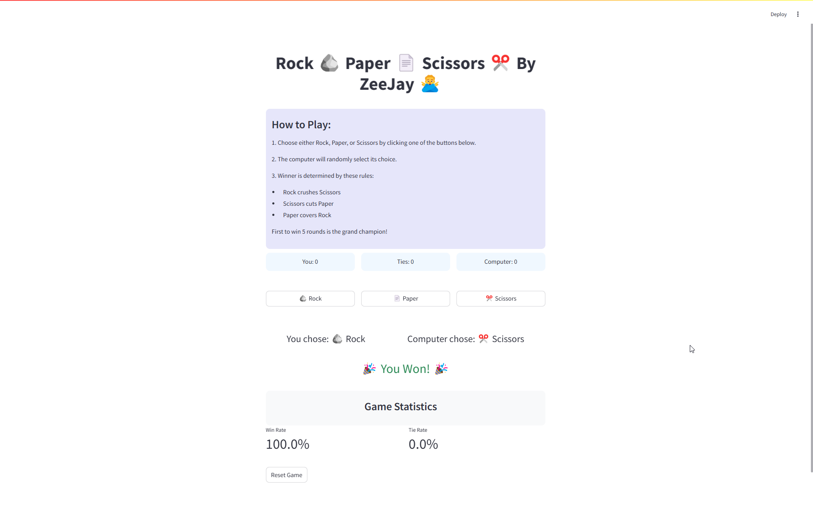
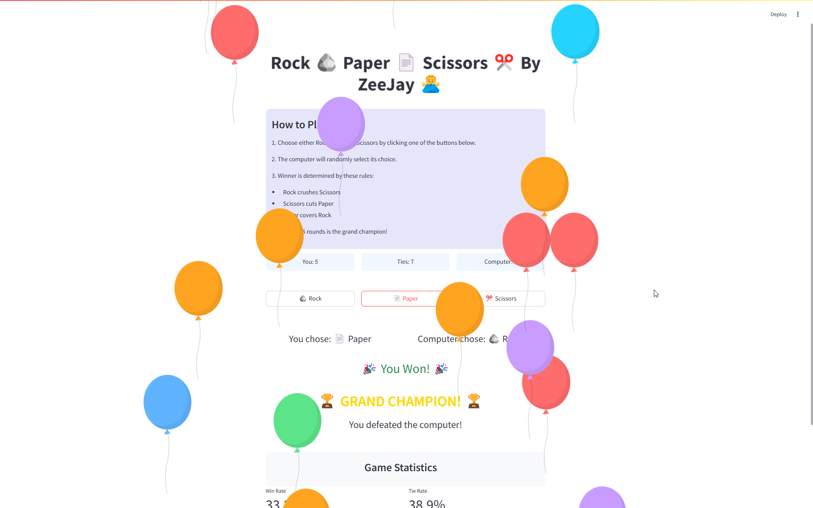

# ✊💽✂️ Rock Paper Scissors - Battle Against AI! 🎮 

A **fun and interactive Rock Paper Scissors game** built using **Python & Streamlit**. Challenge the **AI**, track your scores, and celebrate victories with animations! 🎉 

---

## 🔥 **Game Features**  
🔹 **Play Rock, Paper, or Scissors with a single click!**  
🔹 **AI-powered opponent 🤖** – Computer randomly selects its choice.  
🔹 **Live Score Tracking** – Keep count of wins, ties, and losses.  
🔹 **🎉 Celebrations** – **Balloons for winning streaks** & **special effects for ties**.  
🔹 **🏆 Champion Mode** – First to 5 wins **becomes the Grand Champion!**  
🔹 **Game Statistics** – Win & tie rate calculations for performance tracking.  
🔹 **Modern UI & Animations** – Styled with custom **CSS** for a polished look.  

---

## 🎮 **How to Play**  
1⃣ Click **Rock (🪨), Paper (💽), or Scissors (✂️)** to make your move.  
2⃣ The **computer will choose randomly**.  
3⃣ The **winner is determined based on the rules:**  
   - **Rock crushes Scissors** (✊ > ✂️)  
   - **Scissors cuts Paper** (✂️ > 💽)  
   - **Paper covers Rock** (💽 > ✊)  
4⃣ **First to 5 wins is crowned the Grand Champion! 🏆**  

---

## 🚀 **Live Demo**  
🔗 **Play Here:** [Live Link Goes Here]  

---

## 🖼️ **Screenshots**  
### 🎲 Game Interface  
  

### 🏆 Winning Celebration  
  

---

## 🛠 **Installation & Setup**  

### 1⃣ Install Streamlit (if not installed)  
```sh  
pip install streamlit  
```

### 2⃣ Clone the Repository  
```sh  
git clone https://github.com/zohaib-javd/rock-paper-scissors.git  
cd rock-paper-scissors  
```

### 3⃣ Run the App  
```sh  
streamlit run app.py  
```

---

## 🛠 **Tech Stack**  
- **Python** 🐍  
- **Streamlit** 🎨 
- **CSS Animations** ✨  
- **Random Module** 🎲 

---

## 🎯 **Future Enhancements**  
🔹 **Multiplayer Mode** – Challenge friends in real-time!  
🔹 **Custom Score Limit** – Choose your own match length.  
🔹 **Leaderboard** – Keep track of top players.  

---

## 🤝 **Contribute & Support**  
Want to improve **Rock Paper Scissors - Battle Against AI**? **Fork the repo, make updates, and submit a pull request!** 🚀  

💬 Feel free to reach out if you have suggestions or feedback!  

---

## 📩 **Contact & Socials**  

👤 **Zohaib Javed**  
🔗 **LinkedIn:** [linkedin.com/in/zohaib-javd](https://linkedin.com/in/zohaib-javd)  
🌍 **Website:** [github.com/zohaib-javd](https://github.com/zohaib-javd)  
📧 **Email:** [zohaibjaved@gmail.com](mailto:zohaibjaved@gmail.com)  

---

### ✊💽✂️ **Who will win? Play now and challenge the AI!** 🎮🚀  
Let me know if you need any modifications! 🔥
